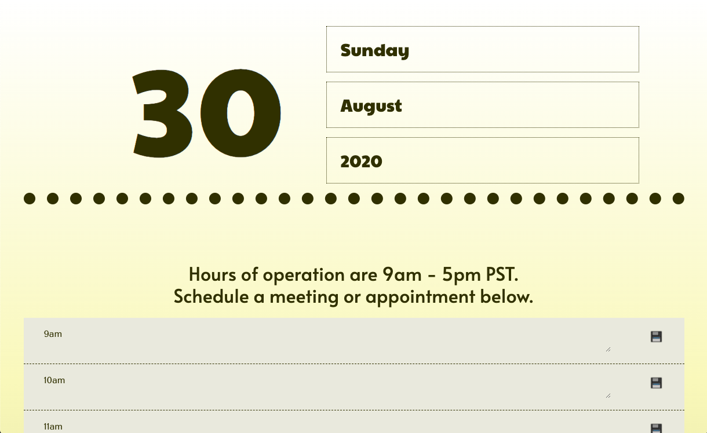

Calendar Header
1. displays current date in bootstrap columns
1. day will automatically display current date

Schedule
1. If time has passed or is current, textarea will be readonly and color will be different
1. For future times, user is able to type appointment details into textarea in center column and save to local storage
1. To delete text, just clear textarea and click on save icon

[CLICK HERE FOR DEPLOYED APP](https://baytamo.github.io/05-scheduler/)

